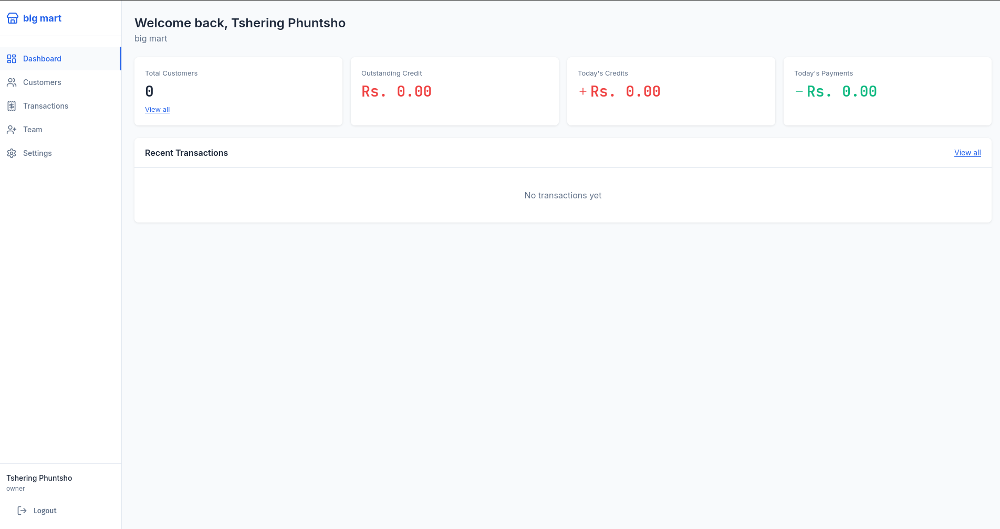

# CreditBook

A comprehensive credit management system for shopkeepers with automated CI/CD pipeline, real-time transaction tracking, and intelligent credit analytics.

## Overview

CreditBook is an intelligent credit management platform designed for small business owners and shopkeepers. It provides real-time credit tracking, transaction management, and comprehensive financial reporting with a focus on simplicity and efficiency.

### Key Capabilities
- Real-time credit management and tracking
- Automated transaction recording
- Customer credit history and analytics
- Receipt generation and management
- Multi-user support with role-based access
- Supabase-powered data persistence
- Production-ready REST API
- Responsive React-based frontend

## Features

### Backend Features
- **RESTful API** - Express.js based API with comprehensive endpoints
- **Authentication** - JWT-based secure authentication
- **Database** - PostgreSQL via Supabase with migrations
- **Validation** - Input validation using Joi
- **Error Handling** - Comprehensive error handling middleware
- **PDF Generation** - Receipt generation with PDFKit

### Frontend Features
- **Responsive UI** - Modern React with Vite
- **Real-time Updates** - Axios-based API integration
- **Routing** - React Router for navigation
- **Context API** - State management for authentication
- **Component-Based** - Modular and reusable components
- **Professional Design** - Lucide React icons

### DevOps & CI/CD
- **Automated Testing** - Jest (backend) and Vitest (frontend)
- **Code Quality** - ESLint for both frontend and backend
- **Docker Support** - Containerized deployment
- **GitHub Actions** - Automated testing and deployment
- **Code Coverage** - Test coverage reporting
- **Supabase Integration** - Cloud database for testing and production

## Screenshots

### Sign In Page


### Dashboard


## Tech Stack

### Backend
- **Runtime**: Node.js 18+
- **Framework**: Express.js
- **Database**: PostgreSQL (Supabase)
- **Authentication**: JWT (jsonwebtoken)
- **Validation**: Joi
- **Testing**: Jest
- **Linting**: ESLint
- **Migration**: Knex.js

### Frontend
- **Framework**: React 19
- **Build Tool**: Vite
- **Testing**: Vitest
- **Linting**: ESLint
- **HTTP Client**: Axios
- **Routing**: React Router v7
- **UI Icons**: Lucide React
- **Styling**: CSS Modules

### Infrastructure
- **Containerization**: Docker
- **CI/CD**: GitHub Actions
- **Deployment**: Render
- **Container Registry**: GitHub Container Registry
- **Code Analysis**: SonarCloud (optional)


## CI/CD Pipeline

### Overview
We have implemented a comprehensive CI/CD pipeline that automatically tests, builds, and deploys your application on every code commit.

### Complete Automated Workflow

```
Developer Pushes Code
    ↓
GitHub Detects Push
    ↓
┌─────────────────────────────────────────┐
│  TEST WORKFLOW (test.yml)               │
│  Runs in parallel:                      │
├─────────────────────────────────────────┤
│ Backend Tests Job (5-7 min)             │
│  ├─ Setup Node.js 18                    │
│  ├─ Install dependencies                │
│  ├─ Connect to Supabase test DB         │
│  ├─ Run Jest unit tests                 │
│  ├─ Run ESLint linting                  │
│  ├─ Generate coverage report            │
│  └─ Upload to Codecov                   │
├─────────────────────────────────────────┤
│ Frontend Tests Job (4-6 min)            │
│  ├─ Setup Node.js 18                    │
│  ├─ Install dependencies                │
│  ├─ Run ESLint linting                  │
│  ├─ Build with Vite                     │
│  ├─ Run Vitest unit tests               │
│  └─ Upload build artifacts              │
├─────────────────────────────────────────┤
│ Code Quality Job (2-3 min)              │
│  ├─ SonarCloud analysis                 │
│  └─ Code metrics                        │
├─────────────────────────────────────────┤
│ Docker Build Job (8-10 min)             │
│  ├─ Setup Docker Buildx                 │
│  ├─ Build backend image                 │
│  ├─ Build frontend image                │
│  └─ Push to GitHub Container Registry   │
└─────────────────────────────────────────┘
    ↓
    All Tests Pass? ✓
    ↓
┌─────────────────────────────────────────┐
│  DEPLOY WORKFLOW (deploy.yml)           │
│  Triggered after test.yml success       │
├─────────────────────────────────────────┤
│ 1. Deploy Backend                       │
│    └─ Trigger Render webhook            │
│       ├─ Render pulls latest image      │
│       ├─ Stops old container            │
│       ├─ Starts new container           │
│       └─ Routes traffic                 │
│                                         │
│ 2. Wait 30 seconds                      │
│                                         │
│ 3. Deploy Frontend                      │
│    └─ Trigger Render webhook            │
│       ├─ Render pulls latest image      │
│       ├─ Stops old container            │
│       ├─ Starts new Nginx container     │
│       └─ Routes traffic                 │
└─────────────────────────────────────────┘
    ↓
Production Updated Successfully! ✓

If Any Test Fails:
    ↓
Workflow Stops ✗
    └─ Error notification in GitHub
    └─ PR marked as failing
    └─ Deployment blocked
```

**What Render Does:**
1. **Receives webhook** from GitHub Actions
2. **Pulls latest image** from GitHub Container Registry
3. **Stops** currently running container
4. **Starts** new container with latest code
5. **Routes traffic** to new deployment
6. **Monitors** health checks

## Docker & Containerization

### Overview

Both frontend and backend are containerized using Docker, ensuring consistency across development, testing, and production environments.

### Backend Dockerfile

The backend is containerized as a Node.js application:

**File:** `backend/Dockerfile`

```dockerfile
# Build stage
FROM node:18-alpine
WORKDIR /app
COPY package*.json ./
RUN npm ci --only=production
COPY . .
EXPOSE 3001
CMD ["node", "src/index.js"]
```

**Key Features:**
- Alpine Linux base for smaller image size
- Production dependencies only
- Port 3001 exposed
- Automatic startup with Node.js


### Frontend Dockerfile

The frontend is containerized with Nginx for optimal performance:

**File:** `frontend/Dockerfile`

```dockerfile
# Build stage
FROM node:18-alpine as builder
WORKDIR /app
COPY package*.json ./
RUN npm ci
COPY . .
RUN npm run build

# Production stage
FROM nginx:alpine
COPY --from=builder /app/dist /usr/share/nginx/html
COPY nginx.conf /etc/nginx/conf.d/default.conf
EXPOSE 80
CMD ["nginx", "-g", "daemon off;"]
```

**Key Features:**
- Multi-stage build (builder + production)
- Build artifacts served by Nginx
- Port 80 exposed
- Lightweight Alpine Nginx image
- Custom Nginx configuration

### Render Deployment

The application is deployed on Render using Docker containers with automatic deployments triggered by the CI/CD pipeline.

#### Backend Service

**Service Details:**
- **Name:** cicd-creditbook-backend
- **URL:** https://cicd-creditbook-backend.onrender.com
- **Runtime:** Docker
- **Region:** Oregon
- **Plan:** Free
- **Port:** 3001

**How Deployment Works:**
1. GitHub Actions builds backend Docker image
2. Image is pushed to GitHub Container Registry
3. Render detects image update
4. Renders pulls latest image
5. Container is restarted with new image
6. Traffic automatically routed to new deployment

#### Frontend Service

**Service Details:**
- **Name:** cicd-creditbook-frontend
- **URL:** https://cicd-creditbook-frontend.onrender.com
- **Runtime:** Docker
- **Region:** Oregon
- **Plan:** Free
- **Port:** 80 (via Nginx)

**How Deployment Works:**
1. GitHub Actions builds frontend Docker image
2. Image is pushed to GitHub Container Registry
3. Render detects image update
4. Render pulls latest image
5. Nginx container restarts with built frontend assets
6. Frontend accessible at production URL

## Project Structure

```
.
├── backend/                    # Node.js/Express API
│   ├── src/
│   │   ├── index.js           # Application entry point
│   │   ├── controllers/       # Route controllers
│   │   ├── middleware/        # Express middleware
│   │   ├── routes/            # API routes
│   │   ├── services/          # Business logic
│   │   └── db/                # Database configuration
│   ├── __tests__/             # Test files
│   ├── jest.config.js         # Jest configuration
│   └── .eslintrc.js          # ESLint configuration
│
├── frontend/                   # React application
│   ├── src/
│   │   ├── main.jsx          # Application entry point
│   │   ├── App.jsx           # Root component
│   │   ├── pages/            # Page components
│   │   ├── components/       # Reusable components
│   │   ├── context/          # React context
│   │   ├── services/         # API services
│   │   └── __tests__/        # Test files
│   ├── vitest.config.js      # Vitest configuration
│   └── vite.config.js        # Vite configuration
│
├── .github/
│   ├── workflows/
│   │   ├── test.yml          # Test and build workflow
│   │   └── deploy.yml        # Deployment workflow
│   ├── GITHUB_SECRETS.md     # Secrets setup guide
│   ├── SUPABASE_INTEGRATION.md
│   └── WORKFLOW_BADGES.md
│
└── README.md                  # This file
```

